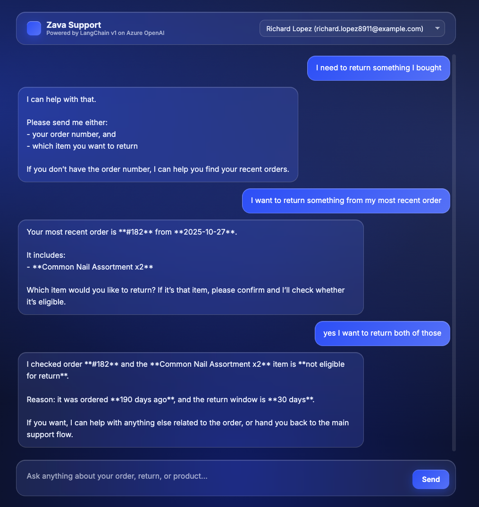
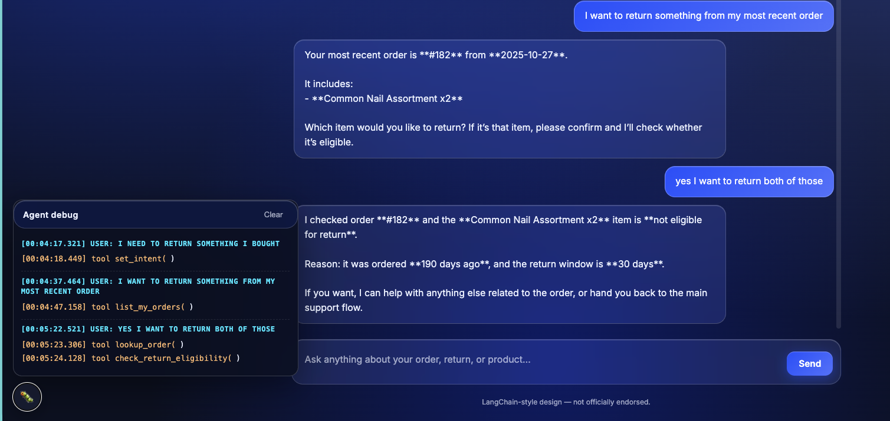
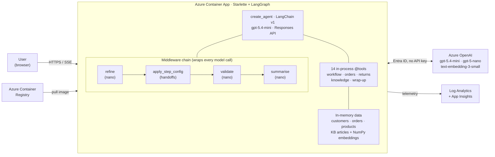

<!--
---
name: LangChain customer-support agent on Azure (Python)
description: Multi-step support agent built with LangChain v1 and Azure OpenAI, deployed to Azure Container Apps with azd.
languages:
- python
- bicep
- azdeveloper
products:
- azure-openai
- azure-container-apps
- azure-container-registry
- azure
page_type: sample
urlFragment: langchain-azure-customer-support-agent
---
-->

# LangChain customer-support agent on Azure (Python)

A production-style customer support chat agent built with **LangChain v1**, **Azure OpenAI Responses API**, and **Azure Container Apps**. One LangChain agent simulates six specialist support roles via a handoffs state machine, with cheap-model reliability layers (refine query, validate response, summarise history) wrapped around the main model.





> [!IMPORTANT]
> This sample is built to showcase Azure-specific services and patterns. Do not put this code into production without adding authentication, rate limiting, and the security controls described in the [Azure OpenAI Landing Zone reference architecture](https://techcommunity.microsoft.com/blog/azurearchitectureblog/azure-openai-landing-zone-reference-architecture/3882102).

## Table of contents

- [Features](#features)
- [Architecture](#architecture)
- [Quick start](#quick-start)
- [Local development](#local-development)
- [How it works](#how-it-works)
- [Project structure](#project-structure)
- [Clean up](#clean-up)
- [Resources](#resources)

## Features

- **Single LangChain v1 agent** — `create_agent(...)` with a `gpt-5.4-mini` driver model and a cheap `gpt-5-nano` utility model.
- **Handoffs state machine** — one agent acts like six specialists (`triage`, `order_lookup`, `returns`, `tech_support`, `product_qna`, `resolution`) by swapping system prompt and tool list per turn.
- **Reliability middlewares** — `refine_query` (clarify vague input), `validate_response` (groundedness check), `SummarizationMiddleware` (long-conversation memory).
- **Streaming UI** — Server-Sent-Events stream from the Responses API straight to a single-page web client, with a debug drawer that shows tool calls, handoffs, and citations live.
- **In-memory data only** — JSON files for customers, orders, products, warranty terms, plus a NumPy KB-embeddings file. No Postgres, no vector DB.
- **Entra ID auth** — managed identity from the Container App to Azure OpenAI; no API keys.
- **Bicep + azd** — one Container App, ACR, Container Apps environment, Azure OpenAI, Log Analytics, App Insights.

## Architecture



The full editable diagram lives in [docs/architecture.md](docs/architecture.md).

## Quick start

### Prerequisites

- An Azure subscription with permission to create resources and assign roles.
- [Azure Developer CLI (`azd`)](https://aka.ms/azure-dev/install) `1.10+`.
- [Azure CLI (`az`)](https://learn.microsoft.com/cli/azure/install-azure-cli) — for `az login`.
- [Docker](https://docs.docker.com/get-docker/) (only if you want a local image build; `azd up` builds remotely on ACR).
- Python `3.11+` for local development.

### Deploy

```bash
git clone https://github.com/Azure-Samples/langchain-azure-customer-support-agent
cd langchain-azure-customer-support-agent
az login
azd up
```

You'll be asked for an environment name and a region. Pick a region that has the chosen models — `swedencentral` and `eastus2` both work. `azd up` provisions the infra, builds the container image on ACR, and deploys to Container Apps. When it finishes, the chat URL is printed — open it in a browser.

Typical end-to-end time from `azd up`:

| Phase | Approx. time |
|---|---|
| Resource group + identities + ACR + monitoring | 30s |
| Azure OpenAI + 3 model deployments | 90s |
| Container Apps environment | 60s |
| Image build (uv + BuildKit cache) | 45s |
| Container App + first revision | 45s |

### Try it

Open the URL printed by `azd` and try:

- *"Where is my most recent order?"*
- *"I need to return something I bought."*
- *"My drill won't turn on."*
- *"Do you sell a 16oz claw hammer?"*

Click the bug icon in the bottom-left to see the live debug drawer (tool calls, handoffs, citations).

## Local development

```bash
cp .env.example .env       # then set AZURE_OPENAI_ENDPOINT
python -m venv .venv && source .venv/bin/activate
pip install -r requirements.txt
az login                   # for DefaultAzureCredential
uvicorn app.main:app --reload
```

Open <http://localhost:8000>. Local dev still talks to the Azure OpenAI deployment created by `azd up` (or whatever endpoint you set in `.env`).

## How it works

There is **only one LangChain agent**. It calls the LLM through a four-middleware chain that runs on every turn:

| # | Middleware | Phase | Job |
|---|---|---|---|
| 1 | `refine_query` | pre-call | Rewrites vague user messages into explicit queries. |
| 2 | `apply_step_config` | pre-call | Reads `state["current_step"]` and swaps the system prompt + filters the tool list to that step's allowlist. |
| 3 | `validate_response` | post-call | Groundedness-checks the model's reply; in `rewrite` mode replaces hallucinations with a safe "ask before escalate" template. |
| 4 | `SummarizationMiddleware` | pre-call | Built-in. Condenses old messages once history exceeds 4000 tokens. |

The agent doesn't decide which "specialist" to be — it just calls a tool. Three tools mutate the step:

- `set_intent(intent)` — called from `triage` and routes to a specialist (`return_or_refund` → `returns`, etc.).
- `back_to_triage()` — specialist hands back when work is done.
- `escalate_to_human(reason)` — explicit user-confirmed escalation.

Each returns `Command(update={"current_step": ...})`. LangGraph applies the update, checkpoints state, and on the next turn `apply_step_config` reads the new value and shows the LLM a different prompt and tool subset.

For full speaker-notes-style write-ups, see [docs/slides/layer-1-middlewares.md](docs/slides/layer-1-middlewares.md) and [docs/slides/layer-2-handoffs.md](docs/slides/layer-2-handoffs.md).

## Project structure

```
app/                      Starlette entrypoint, agent build, middleware, tools, prompts, static UI
  agent.py                build_agent(): create_agent + middleware chain
  main.py                 Starlette app, lifespan, /api/chat SSE endpoint
  state.py                SupportState (current_step, intent, customer_id, ...)
  middleware/
    refine.py             nano model rewrites the user query
    steps.py              apply_step_config — handoffs state machine
    validate.py           nano model groundedness check
  tools/                  14 in-process @tools (workflow, orders, returns, kb, ...)
  prompts/                one .txt file per specialist step
  static/index.html       chat UI + debug drawer
data/                     50 customers, 200 orders, 30 products, 4 warranty rows, 12 KB articles
infra/                    Bicep (Container App, ACR, AOAI, monitoring)
docs/                     Architecture and slide notes
tests/                    pytest suite
azure.yaml                azd service definition
Dockerfile                Container image (uv + BuildKit)
```

## Clean up

```bash
azd down --purge
```

`--purge` deletes the soft-deleted Azure OpenAI resource so you can recreate the same environment name later without quota collisions.

## Resources

- [LangChain v1 — customer support handoffs](https://docs.langchain.com/oss/python/langchain/multi-agent/handoffs-customer-support)
- [Azure OpenAI Responses API](https://learn.microsoft.com/azure/ai-services/openai/how-to/responses)
- [Azure Container Apps](https://learn.microsoft.com/azure/container-apps/overview)
- [Azure Developer CLI](https://learn.microsoft.com/azure/developer/azure-developer-cli/)
