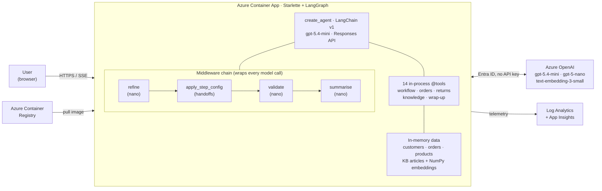

# Architecture

The deployed sample is a single Azure Container App backed by Azure OpenAI, ACR, and monitoring. All conversation data is in-memory; there is no database.

## Key choices

- **One Container App, one agent.** No separate frontend service, no MCP server, no Postgres.
- **Two model tiers.** `gpt-5.4-mini` runs the support driver; the much cheaper `gpt-5-nano` runs the three reliability middlewares.
- **In-memory data.** Knowledge-base lookups are NumPy cosine similarity over pre-computed embeddings; everything else is dictionary access into JSON loaded at startup.
- **Entra ID, no API keys.** The Container App's managed identity is assigned the Cognitive Services User role on Azure OpenAI; tokens come from `DefaultAzureCredential`.
- **Streaming.** The Responses API streams `output_text` deltas; Starlette forwards them as Server-Sent Events to the browser.

## Layered explainers

- [Layer 1 — Primary agent + 4 middlewares](slides/layer-1-middlewares.md)
- [Layer 2 — Handoffs via `apply_step_config`](slides/layer-2-handoffs.md)
